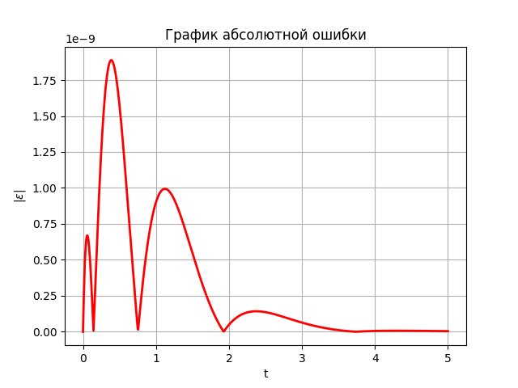
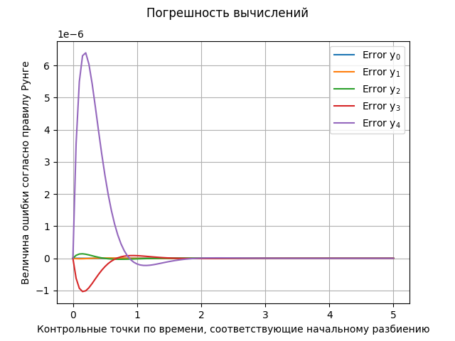

# Продвинутый решатель систем дифференциальных уравнений

##  Описание проекта:
Требуется написать решатель дифференциальных уравнений, который будет использовать итеративное сгущение сетки, на которой ищется решение, для достижения наиболее точного решения согласно заданной точности.

## Содержимое 📂
- `Task` - тестирование работы решателя на контрольном примере
- `Solvers` — модуль, в котором реализованы различные численные методы
- `ODE_Solve` —  модуль, в котором реализован класс для решения систем дифференциальных уравнений
- `requirements.txt` — зависимости проекта
- `Images` - примеры визуализаций

## Цели проекта :dart::
* Написать решатель и проверить его работу на контрольном примере.
* Использовать различные численные методы, обладающие различной устойчивостью и точностью.

## Заключение по итогам проекта:
1. Построен решатель со сгущением сетки и различными численными методами поиска решения.
2. Протестирована его работа на контрольном примере.
3. Максимальная абсолютная ошибка между результатами численного и аналитического решения не превышает 2e-9 на всем временном интервале.

## Примеры визуализаций проекта:

   
  <b>График абсолютной ошибки</b>

  <!-- небольшой отступ между картинками -->

   
  <b>Величина ошибки согласно правилу Рунге</b>

## Использованные инструменты и языки:
* Python
* Numpy
* Matplotlib

## Направления деятельности:
* Численные методы
* Математический анализ
